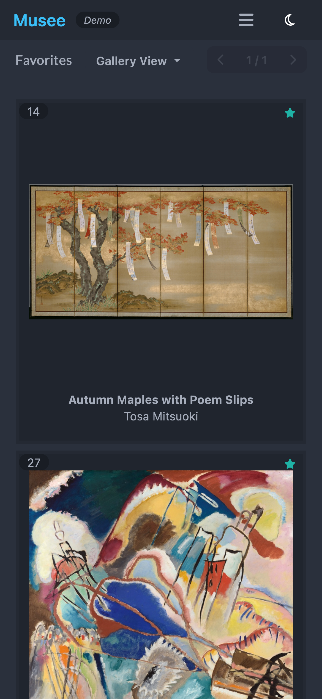

# [Musee](https://monocle.github.io/musee/#/)

## Introduction

This is an independent portfolio project built using React.js and leverages TanStack Query and Router, TailwindCSS and Mock Service Worker. The focus of this project is to demonstrate my React proficiency and ability to learn and implement new libraries and APIs effectively.

## Motivation

From the outset, Musee was designed as a front end only demo app, embracing an iterative and spontaneous development process. Even without a backend API, the project is structured in a way that allows for potential smooth integration with an app server in the future.

This project has allowed me to focus on core frontend development skills, particularly in working with APIs, and creating user-friendly UIs. By adopting an iterative approach, I've navigated challenges as they arise, thereby strengthening my problem-solving skills and my proficiency in modern front end technologies.

## Key Features

Inspired by the beautiful world of fine art, [Musee](https://monocle.github.io/musee/) is a web app that allows users to explore paintings from the [Art Institute of Chicago](https://www.artic.edu/).

The key features of Musee include:

* A gallery showcasing 200 of the Art Institute of Chicago's public domain paintings:

* A detailed view for each painting that provides more information about the artwork including a link to the AIC page for the painting:

* The ability to favorite paintings so that users can create their own personalized collections:

  
   
  <em>Mobile View</em>

## Learning Journey & Technical Challenges

1. __Getting Back into React Development and Embracing New Libraries__  
After a gap in web development, I chose this project as part of getting reacquainted with React and modern front end tools. I intentionally selected TanStack's Query and Router, and Tailwind CSS, despite my previous experience with React Router, Redux, and Bootstrap. This challenge provided an opportunity to get hands-on with different libraries and enhance my adaptability as a developer.

1. __Styling with TailwindCSS and daisyUI__  
Given my self-proclaimed weakness in styling, adopting Tailwind CSS was a deliberate decision to push myself and improve my styling skills. I supplemented Tailwind with daisyUI to accelerate the process. This venture improved my CSS understanding and utility-first design approach, even though styling remains an area of further growth.

1. __REST API Development with Mock Service Worker__  
In the absence of a backend API server, I simulated one using Mock Service Worker. This created a mock REST API for the application, allowing me to design and fine-tune front end behavior and user interface based on simulated server responses. This experience not only added to the project's complexity but also prepared me for potential future integration with an actual backend server.

1. __State Persistence__  
One of the crucial aspects of Musee is state persistence. This was achieved by leveraging local storage and URLs, a strategy which not only enhances the user experience but also introduced me to advanced state management techniques. This allows users to bookmark or refresh their pages without losing their place in the application, thereby providing a smoother browsing experience. This state persistence was also crucial in implementing the favorites feature.

1. __DevOps and CI/CD__  
One of Musee's development goals was to introduce robust DevOps practices through setting up continuous integration and deployment (CI/CD). Building a CI/CD pipeline was a challenging and rewarding process. It involved learning to configure GitHub workflows, understanding how to automate testing and code style checks with tools like ESLint, and setting up automatic builds and deployments to GitHub Pages. These practices were crucial in maintaining high code quality and ensuring smooth, automated deployments.

1. __Embracing Testing Practices__  
Given Musee's iterative development and my initial focus on new libraries, I prioritized feature implementation. However, understanding the importance of testing, I back-filled tests after core functionalities were built. This approach allowed me to validate Musee's stability, improve code quality, and further familiarize myself with testing tools like Vitest and React Testing Library.

## Technical Details

This is a TypeScript React app that is built with Vite. Supporting libraries include:

* [Axios](https://axios-http.com/docs/intro)
* [TanStack Query](https://tanstack.com/query/latest)
* [TanStack Router](https://tanstack.com/router/v1)
* [Tailwind CSS](https://tailwindcss.com/)
* [daisyUI](https://daisyui.com/)
* [Fort Awesome Icons](https://fortawesome.com/)

### Mock Server

The frontend is designed to interface with a backend API server, simulated via [Mock Service Worker](https://mswjs.io/).

### Data

To better align with my goal of maintaining proficiency in Python - my secondary web development language - Python scripts were employed to fetch and process data from the [Art Institute of Chicago's API](https://api.artic.edu/docs/). In a future enhancement of the project where a server is to be added, it would likely be written in Python. However, for now, the processed data is served as static Github pages files.

### Testing and DevOps

Testing is conducted using [Vitest](https://vitest.dev/) and [React Testing Library](https://testing-library.com/docs/react-testing-library/intro/).

Separate Docker containers are used for the TypeScript frontend and the Python scripts. A Makefile is used to provide convenience Docker commands.

To support a robust development process, a CI/CD GitHub workflow is implemented. This workflow is configured to run tests, check the code style with Prettier and ESLint, and automatically build and deploy the application to GitHub Pages whenever changes are merged into the main project branch.

## Contact

Email: monocle.github@gmail.com
